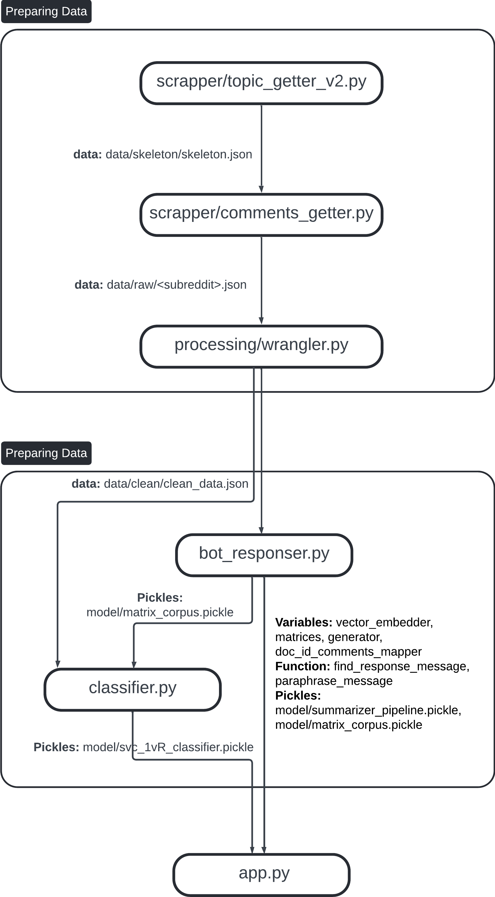

**About Project**
- The idea is to create a simple chatbot that can classify the mental health syndrome based on the message sent by users
- The bot will do 2 jobs for each message from user:
  - Categorize patients story by `all-MiniLM-L6-v2` vectorizer and `SVC` model into **7 type** of mental issues: 
Bipolar Disoder, Depression, Anxiety, PTSD, OCD, Eating Disorders (ED), ADHD
  - Response/Advice to patients story by using on a Hybrid solution: `LLM-IR` (Large Language Model - Information Retrieval)
- You can look at the diagram below to understand the pipeline


**Collecting Data**
0. I used the Reddit data about the **7 types** of mental health issue in this project
1. Consolidate the subreddits that relating to each topics and store information into the `./config.py` file
```
sub_reddit_group = [
    {
        "type": "Bipolar Disoder", # a type of a mental health issue
        "subreddits": [ # a list of subreddit relate to corresponding mental health issue
            "bipolar", 
            "BipolarReddit",
            "BipolarSOs"
        ]
    },
    ...
]
```
2. Run the `scrapper/topic_getter_v2.py` file to create `data/skeleton/skeleton.json`. At the moment, 
this file still using variable `reddit_sub_reddits` as guideline to collect the topics, but you can easily modify the 
for loop so that it uses variable `sub_reddit_group` from step 1. The content of skeleton file gonna look like this
```
[
    {
        "subreddit": "bipolar",
        "topics": [
            "https://www.reddit.com/r/fuckeatingdisorders/comments/1hxozjd/feeling_like_i_have_to_get_worse_before_i_can_get/",
            "https://www.reddit.com/r/fuckeatingdisorders/comments/1hs8tby/how_did_you_realize_that_your_extreme_hunger_was/",
            ...
        ]
    },
    ...
]
```
3. Run the `scrapper/comments_getter.py` file to create `data/raw/{subreddit}.json` files, each of which contains raw 
json data for topics with the SAME subreddit. The comment_getter picks up data from skeleton file from step 2.
4. Run the `processing/wrangler.py` file to create `data/clean/clean_data.json` file. This is the clean data that ready 
to be used to trained the model. The content of clean_data.json is:
```
[
    {
        "group": <String> eg: "Bipolar Disoder",
        "subreddit": <String> eg: "bipolar",

        "post_title": <String> "first anger outburst in years",
        "post_content": <String> eg: "okay so when I'm in depressive episodes I experience flashes of extreme anger, these flashes can last for multiple days and the other day it was directed at my boyfriend because I misinterpreted something he said and assumed he was talking about another woman and cheating on me when he was really talking about me in 3rd person"
        "post_created_utc": <Float> eg: 1736978802.0,
        "post_author": post_author <String>,
        "post_score": post_score <Integer> eg: 4,

        "comments_list": [
            {
                "comment_content": <String> similar to above,
                "comment_created_utc": <Float> similar to above,
                "comment_author": <String>,
                "comment_score": <Integer> eg: 5
            },
            ...
        ]
    }
    ...
]
```

**Building Models**
1. Build the *responser* by running `bot_responser.py` file, this process may take upto 15 minutes for the first time
to generate 2 pickle file (which will later be used in the app.py): `matrix_corpus.pickle` and `summarizer_pipeline.pickle`
2. Build the *classifier* by running `classifier.py` file, this process may take upto hours to generate best `SVC` 
model with the best hyperparameters by GridSearch method `svc_1vR_classifier.pickle` (which will later be used in the app.py)
3. Once you have 3 pickle files in `data/model/` folder, you are good to go `Setup` step
- *Note*: I chose SVC after several experiments on LogisticRegression, all the Tree/Forrest, MLP classifier

**Setup**
```
pip install -r /path/to/requirements.txt

python app.py
```